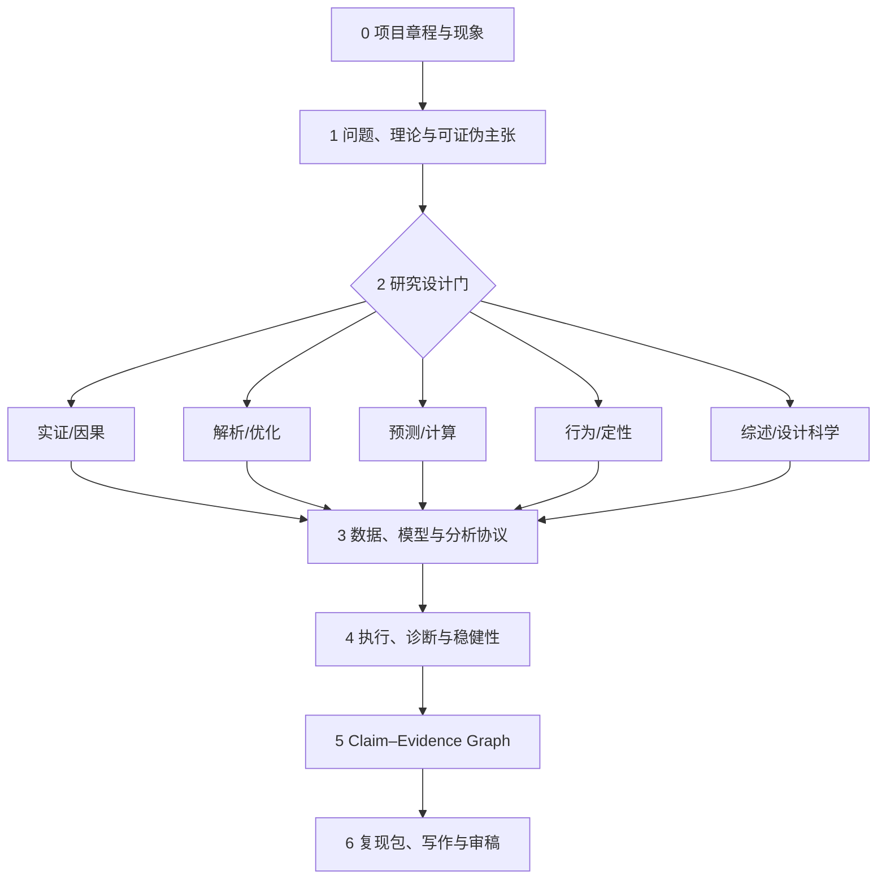

# 管科统一研究范式：统一骨架，而不是统一方法

## 结论

100 篇设计语料显示，管科研究不能被压成“检索—写作”这一条线。样本中主要范式为：规范/处方型 28 篇、实证解释型 25 篇、解析机制型 10 篇、证据综合型 10 篇、理论构建型 8 篇、因果解释型 7 篇、预测计算型 7 篇、探索/理论生成型 4 篇、设计构建型 1 篇。

可统一的是**阶段、研究资产、证据链和质量门禁**；不可统一的是识别策略、目标函数、数据生成过程与验证标准。因此，产品应采用“一个母流程 + 五条方法泳道 + 一个再汇合的证据层”。

## 母流程的 7 个阶段

| 阶段 | 必答问题 | 必须生成的研究资产 | 质量门禁 |
|---|---|---|---|
| 0 项目章程 | 研究什么现象、为谁、为何重要？ | `project_charter.yaml`、边界与非目标 | 研究对象、单位、时间、地域明确 |
| 1 问题与理论 | 解释、预测、优化、构建还是综合？什么结果会推翻主张？ | `research_question.json`、理论图、初始 claims | 问题可检验；理论与贡献不是同义改写 |
| 2 设计门 | 哪条方法泳道与数据生成过程匹配？ | `design_decision.md`、备选设计、威胁清单 | 不以“有数据/会模型”倒推问题；人工批准 |
| 3 协议 | 数据、变量、假设、模型、指标如何预先定义？ | `data_contract.yaml`、`analysis_plan.md`、模型卡、假设登记簿 | 数据许可可用；主要 estimand/KPI 与停止规则明确 |
| 4 执行 | 如何估计/求解/训练？如何排除替代解释？ | 代码、notebook、run manifest、日志、结果表、稳健性矩阵 | 可重复运行；诊断通过；基线与样本外/安慰剂齐备 |
| 5 证据层 | 每个结论由什么证据支持，强度与边界是什么？ | claim cards、evidence graph、反证与不确定性 | 每个核心 claim 有来源、方法、运行和反例链接 |
| 6 交付 | 别人能否复现并审查？ | 论文/报告、参考文献、数据说明、代码环境、审稿答复 | 引文核验、复现测试、隐私许可和版本冻结通过 |

## 五条方法泳道

### A. 实证/因果

适用于观察数据、面板、政策冲击、实验与问卷。核心不是“跑回归”，而是先确定 estimand 和识别假设。

最小流程：理论/DAG → 变量和样本 → 识别设计 → 基准估计 → 诊断 → 稳健性 → 机制/异质性 → 外部效度。

专属门禁：重叠与样本构成、平行趋势/工具有效性/阈值操纵、聚类层级、多重检验、效应量而非只看 p 值。

### B. 解析/优化

适用于运筹优化、库存、物流、定价、平台与供应链博弈。核心是“业务机制—数学表示—计算验证—管理可执行性”闭环。

最小流程：参与者/决策 → 时序与信息 → 目标/效用 → 约束/均衡 → 求解 → 理论性质 → 数值/真实算例 → 敏感性 → 管理含义。

专属门禁：单位与索引、可行性、最优 gap、均衡存在/唯一性、参数现实性、规模可解性、与强基线比较。

### C. 预测/计算

适用于机器学习、NLP、时序、网络和强化学习。核心是严格切分、强基线、样本外价值和部署分布。

最小流程：任务与决策价值 → 标签 → 时间/组别切分 → 特征/表示 → 基线 → 训练 → 校准/解释 → 外部测试 → 漂移与部署。

专属门禁：无信息泄漏、测试集冻结、模型/提示版本、消融、校准、公平/安全、超越预测准确率的决策效益。

### D. 行为/定性

适用于实验、案例、访谈、民族志和理论生成。核心是过程机制、证据链、反例和理论边界。

最小流程：现象 → 理论抽样/实验操纵 → 协议 → 数据采集 → 编码/估计 → 机制 → 负例/操纵检验 → 理论命题。

专属门禁：功效/预注册、流失与不依从、编码一致性、饱和、研究者反思、外部效度。

### E. 综述/设计科学

适用于系统综述、元分析、文献计量和数字人工制品。二者都要求显式协议和透明评估，但产物不同。

- 综述：协议 → 多库检索 → 纳排 → 双人编码 → 质量/偏倚 → 综合 → 研究议程。
- 设计科学：问题 → 设计目标 → 构件 → 原型 → 多维评估 → 迭代 → 可迁移设计原则。

## 产品中的统一数据结构

任何研究项目都由同一组对象组成：

1. `ResearchQuestion`：问题、对象、单位、时空边界、贡献类型；
2. `Claim`：可证伪主张、状态、置信与边界；
3. `Evidence`：论文、数据、统计结果、证明、仿真或质性片段；
4. `Assumption`：识别、行为、数学、数据和部署假设；
5. `MethodCard`：适用目标、输入、假设、流程、诊断、公式与软件；
6. `DataContract`：来源、许可、变量、样本、版本、PII 与质量；
7. `Run`：代码、环境、随机种子、参数、日志和输出哈希；
8. `Artifact`：表、图、模型、论文、审稿记录与复现包。

这组对象形成 Claim–Evidence–Assumption 三角。产品价值不在“自动写更多字”，而在确保每个结论都能反向追踪到数据、方法、运行和假设。

## 对产品策略的直接含义

- 先做 Research Protocol 和 Artifact Registry，再做大而全的论文写作助手。
- 方法推荐必须输出“为什么适用、关键假设、替代方案、失败条件”，不能只返回模型名。
- LLM 负责解释、抽取和建议；检索、统计、求解、哈希、引用校验与门禁应尽量由确定性工具完成。
- 所有阶段允许人工暂停、修改、批准和回滚；关键设计门默认禁止自动越过。
- “生成论文”应是最后一个消费者，而不是整个产品的中心。

