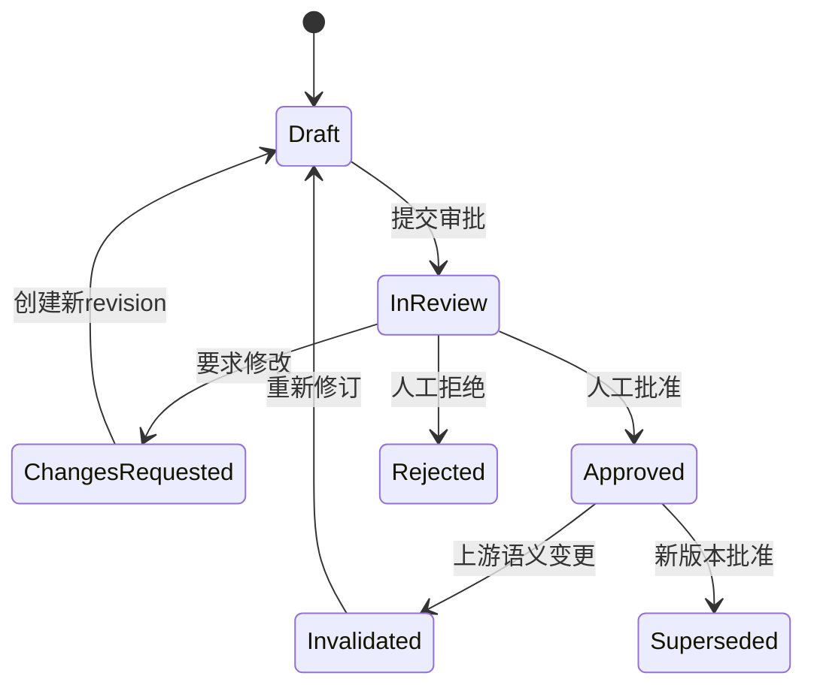

# 人工编辑、审批与版本失效机制

版本：0.3  
日期：2026-07-16

## 1. 核心规则

AI4MS 中所有智能体输出首先都是 `machine_draft`。用户拥有修改、拒绝、分叉和回滚权；只有具备相应角色的人才能批准关键版本。智能体可以准备材料、提出 patch 和检查条件，但不能批准自己或替用户点击通过。

审批不是一个装饰按钮。批准对象必须是确定的 revision/hash；批准后发生语义修改时，下游审批按依赖关系自动失效，必须重新检查。

## 2. 六个不可自动越过的 Gate

| Gate | 批准对象 | 默认批准人 | 可以人工修改的内容 | 通过后解锁 |
|---|---|---|---|---|
| G0 选题与已有研究 | TopicBrief、报告版本、选中候选题 | 研究者 + 导师/PI | 课题表述、边界、流派、空白、候选题 | Research Protocol 草案 |
| G1 问题/理论/设计 | RQ、理论机制、estimand/目标、主备设计、假设 | 导师/PI；方法审核者会签 | 构念、假设、贡献、设计与停止条件 | Data Contract 与详细计划 |
| G2 数据/伦理/许可 | 数据来源、变量、样本、连接键、PII、许可、伦理 | 数据负责人/研究者；受限数据需指定角色 | 数据选择、变量映射、脱敏与执行位置 | 数据准备和分析计划冻结 |
| G3 分析计划与代码冻结 | Analysis Plan、do-file/notebook、环境、主次分析 | 方法审核者 | 模型式、样本、标准误、权重、诊断、代码 patch | 主分析 Run |
| G4 结果与核心 Claim | 运行、诊断、稳健性、支持/反证、Claim 状态 | PI/作者 + 方法审核者 | 解释、边界、置信度、追加检验；不能手改原始数值 | 正式写作与图表引用 |
| G5 成稿与发布 | 稿件、引用、数值一致性、复现包、许可清单 | PI/通讯作者/交付负责人 | 文字、结构、图注和披露 | 导出 final/release 包 |

个人项目允许同一人以 `single_reviewer` 明确自批，但界面必须提示“这不是独立复核”。团队/机构项目默认启用 `four_eyes`，高风险数据和主要因果结论可配置双人会签。

## 3. 编辑模型

### 3.1 三类内容

| 内容 | 是否可直接改 | 正确做法 |
|---|---|---|
| 课题、理论、检索式、纳排、变量映射、分析计划、代码、解释和正文 | 可以 | 创建新 revision，保存差异、原因和作者 |
| 外部论文元数据、原始数据、原始日志、运行数值、哈希 | 不可覆盖 | 创建 correction/annotation 或重新检索/运行 |
| 已批准版本 | 不可原地改 | 从该版本分叉新 revision；旧批准保留并标为 superseded/invalidated |

### 3.2 AI 建议方式

- Agent 默认提交结构化 patch，不静默改正文或字段。
- 用户可以逐项 `接受 / 修改后接受 / 拒绝 / 要求证据 / 稍后处理`。
- 每个 patch 显示修改前后、理由、证据、影响的 Gate 和预计使哪些下游对象失效。
- 批量接受前必须再次展示影响摘要；涉及关键字段时要求填写变更原因。
- 用户直接编辑同样形成 revision，并可请求 Agent 做一致性检查。

## 4. 审批状态机

提交审批时自动生成 Review Packet：对象版本、关键字段、与上一批准版的 diff、Agent 风险、未解决问题、必需检查、影响范围和建议决定。批准人必须看到完整 packet，不能只看一句 Agent 摘要。

## 5. 变更失效矩阵

| 变更范围 | 自动失效 |
|---|---|
| 课题边界、核心概念、候选题 | G0—G5；重新检索影响由系统评估 |
| 研究问题、理论机制、estimand/目标、主设计 | G1—G5 |
| 数据来源、样本期、主要变量、许可或伦理状态 | G2—G5 |
| 主模型、样本规则、标准误、权重、主次结果、do-file | G3—G5 |
| 新运行改变主要结果、关键诊断或稳健性 | G4—G5 |
| Claim 的方向、范围、置信或证据 | G4—G5 |
| 纯排版、错别字且语义 hash 未变 | 仅重新检查 G5 输出；不失效上游 |

自动失效不会删除旧决定。系统追加 `invalidation_event`，记录触发 revision、规则、时间和受影响对象。

## 6. 角色与权限

| 角色 | 编辑 | 提交审批 | 批准 |
|---|---|---|---|
| Researcher/Student | 项目研究资产 | 可以 | 个人模式可单人批准；团队模式受策略限制 |
| Supervisor/PI | 全部研究语义对象 | 可以 | G0/G1/G4/G5 |
| Method Reviewer | 设计、分析、诊断、Claim 评论 | 可以 | G1/G3/G4 |
| Data Steward/Ethics | 数据、许可、隐私与执行位置 | 可以 | G2 |
| Repro Reviewer | 代码、manifest、重跑报告评论 | 可以 | G3/G5 会签 |
| Agent | 只能提交建议 revision/patch | 不可冒充用户提交 | 永远不可批准 |

## 7. 审计记录

每个 Approval 必须包含：

- `project_id/stage_key/gate_id`；
- 被批准的 `asset_revision_id/body_sha256`；
- 请求人、批准人、角色和权限快照；
- `approved/changes_requested/rejected/withdrawn`；
- 检查清单、评论、冲突披露和时间；
- 单人/四眼/多人会签策略；
- 上游批准和证据包 ID；
- 失效/替代关系。

## 8. 页面设计

### Stage Workspace

- 左侧：阶段、完成条件、未解决问题和 Gate 状态；
- 中间：可编辑的结构化文档/代码/表格；
- 右侧：本阶段智能体、证据和 patch 列表；
- 顶部：当前 revision、未保存修改、影响范围；
- 底部：保存草稿、比较版本、提交审批。

### Approval Inbox

- 按项目、Gate、风险、截止时间和申请人筛选；
- 默认显示差异与阻塞项，而不是整份文档从头重读；
- 支持逐项评论、changes requested、批准、拒绝和会签；
- 手机端只允许审阅/评论；高风险批准建议桌面端完成。

## 9. 验收映射

- A36：人工编辑、AI patch、评论、回滚和版本差异完整保留；
- A37：Agent、无权限角色和过期 revision 无法批准；
- A38：上游语义修改正确失效所有下游 Gate，旧审计不丢失；
- A40：完整课题至少经历六个 Gate，用户可在每阶段修改并与主智能体协作。

