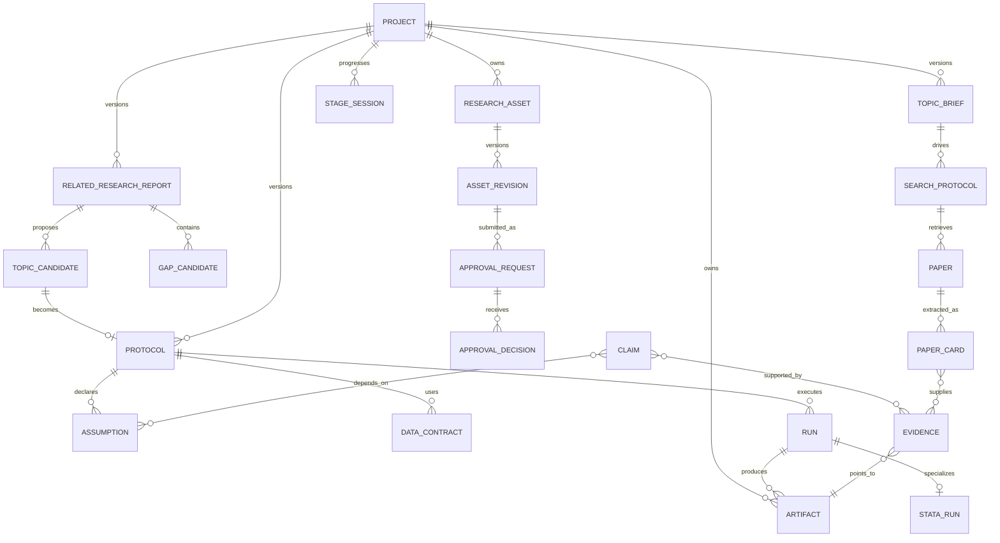
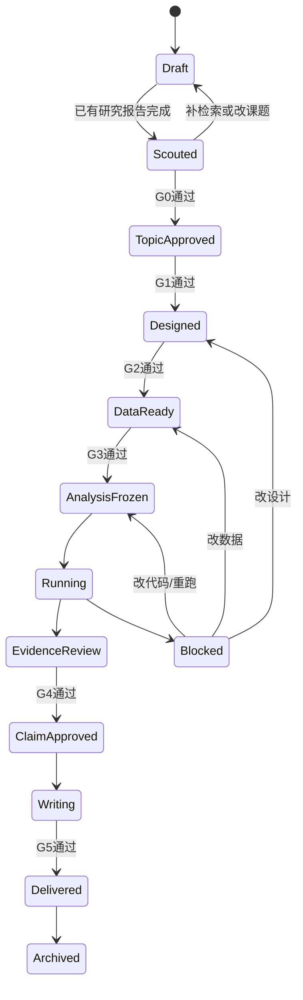

# 信息架构与核心对象

## 1. 一级导航

| 导航 | 页面 |
|---|---|
| Projects | 项目列表、模板、近期活动、风险 |
| Research Journey | S0—S9 当前阶段、主智能体、可编辑资产、待决定问题、handoff |
| Topic Scout | 想法澄清、课题雷达、研究流派、争议/未知、空白地图、候选课题、已有研究报告 |
| Research | Canvas、Protocol、理论/机制图、设计决策 |
| Literature | 搜索、筛选、论文卡、引用网络、综述统计 |
| Data | 数据源、Data Contracts、变量/实体、许可与质量 |
| Methods | 方法、公式、代码模板、适用性比较 |
| Runs | Notebook/do-file、Python/Stata Runner、队列、参数、日志、产物、成本 |
| Approvals | G0—G5 Inbox、版本 diff、检查清单、评论、会签与失效历史 |
| Evidence | Claims、Evidence、Assumptions、Robustness |
| Writing | 大纲、稿件、图表、引用、审稿与导出 |
| Admin | 成员、权限、模型、密钥、审计、配额 |

## 2. 核心实体关系

## 3. 对象定义

| 对象 | 主键与关键字段 | 版本策略 |
|---|---|---|
| Project | id, org, owner, title, status | 项目身份稳定 |
| TopicBrief | project_id, version, idea, concepts, scope, approval | 不可变版本；关键概念修改新版本 |
| SearchProtocol | topic_brief_id, databases, queries, dates, filters, counts | 不可变检索快照 |
| ResearchStream | report_id, name, definition, paper_ids, naming_evidence | 机器草案；人工编辑留历史 |
| EvidenceSynthesis | statement, status, support/opposition IDs, qualifiers | 不可变版本 + 审核状态 |
| GapCandidate | type, statement, counter_search, limitations, confidence | 机器只能 candidate；人工可批准 |
| TopicCandidate | question, contribution, data, methods, assumptions, scores | 随报告版本；选中后映射 Protocol |
| RelatedResearchReport | report_id, version, topic/search/synthesis/gaps/candidates | 不可变；新检索生成新版本 |
| ResearchAsset | project_id, asset_type, external_key | 可编辑研究对象的稳定身份 |
| AssetRevision | asset_id, revision, body, hash, author_type, parent, change_reason | 不可变；AI/人工修改均建新版本 |
| ApprovalRequest | stage, gate, target_revision/hash, policy, status | 决定不可变；上游变更追加失效事件 |
| StageSession | stage_key, principal_agent, status, decisions_needed, handoff | 每阶段可多次进入；历史保留 |
| Protocol | project_id, version, question, design, plan | 不可变版本；新修改新版本 |
| Paper | DOI/OpenAlex ID, title, venue, year | 元数据快照 + 合并记录 |
| PaperCard | paper_id, schema_version, fields, locators, confidence | 每次抽取新版本 |
| DataSource | source_id, access, license, connector | 平台/团队版本 |
| DataContract | project_id, snapshot, variables, PII, license | 绑定协议版本 |
| MethodCard | method_id, assumptions, diagnostics, formulas | 语义版本 |
| FormulaCard | formula_id, LaTeX, notation, assumptions | 语义版本 |
| Run | run_id, protocol_version, code, env, parameters | 不可变；可有 parent run |
| StataRun | run_id, runner, Stata version/edition, do-file hash, data signatures, package manifest | 不可变；数值变化必须新 Run |
| Artifact | artifact_id, URI, hash, media type, lineage | 内容寻址/不可变 |
| Claim | claim_id, text, type, status, scope | 状态可变、历史保留 |
| EvidenceEdge | claim_id, evidence_id, direction, strength | 任何变化写审计 |
| GateDecision | gate, decision, approver, evidence | 不可变审计事件 |

## 4. 项目状态机

已批准对象默认只读。用户点击“修改”时先创建新 AssetRevision，并展示会使哪些 Gate 失效；纯排版变更可以只触发 G5 输出检查，语义变更按依赖矩阵回退状态。

## 5. 搜索与知识索引

- PostgreSQL 保存权威结构化对象与权限。
- 对题名、摘要、卡片和 notes 建全文索引；向量仅用于召回，不作为身份或事实来源。
- DOI、ORCID、ROR、ISSN 是外部规范标识；平台内部 ID 不从题名推断。
- 文本 chunk 必须保留 `paper_id/page/section/char_range/hash`，以便证据定位。
- 任何合并都保留 provenance，支持拆分错误实体。
