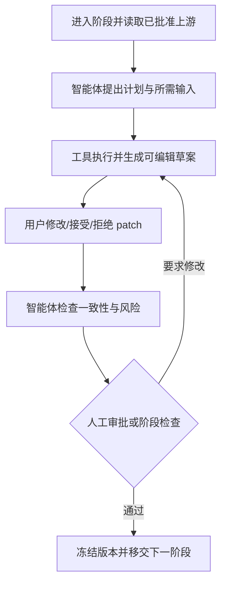

# 分阶段科研智能体与用户协作设计

版本：0.3  
日期：2026-07-16

## 1. 产品规则

用户在每个科研阶段只面对一个“主协作智能体”。主智能体负责解释本阶段目标、准备可编辑草案、调用工具、暴露证据和维护待办；内部可以调用检索、抽取或审稿 helper，但不能把组织复杂度转嫁给用户。

阶段智能体是协作者，不是阶段所有者。研究者决定问题、理论、方法、解释和发布；智能体不能自行审批、修改原始运行结果或跳过前置 Gate。

## 2. 十个阶段与主智能体

| 阶段 | 主智能体 | 智能体负责 | 用户负责 | 可编辑主要资产 | Gate/出口 |
|---|---|---|---|---|---|
| S0 想法与选题 | Topic Agent | 澄清概念、检索已有研究、流派/争议、反向空白、候选题 | 修改边界、补种子论文、选择/改写/暂停课题 | TopicBrief、RelatedResearchReport、TopicCandidate | G0 |
| S1 文献与证据 | Literature Agent | 多源查询、去重、筛选建议、论文卡与引文核验 | 改检索式、决定纳排、纠正卡片 | SearchProtocol、ScreeningDecision、PaperCard | 覆盖/真实性检查 |
| S2 理论与问题 | Theory Agent | 构念定义、机制链、竞争解释、可证伪问题/假设 | 选择理论、重写问题、确认贡献边界 | RQ、TheoryMap、Hypothesis/Proposition | G1一部分 |
| S3 研究设计 | Design Agent | 比较主备设计、estimand/目标、假设、威胁和停止条件 | 选择/修改设计、接受风险、指定审核者 | ResearchProtocol、DesignMemo、AssumptionRegistry | G1 |
| S4 数据与伦理 | Data Agent | 数据源、变量、样本、连接键、质量、PII/许可/伦理 | 确认可得性、修改代理变量和执行位置 | DataContract、VariableMap、EthicsChecklist | G2 |
| S5 分析计划 | Analysis Plan Agent | 主次分析、样本规则、标准误/权重、诊断与稳健性矩阵 | 逐项修改并冻结计划、选择 Python/R/Stata | AnalysisPlan、MethodCard links、CodePlan | G3前置 |
| S6 Stata/计算执行 | Stata Analyst Agent | 生成 do-file patch、预检、批处理运行、日志和结果结构化 | 审代码、批准运行、处理失败、选择重跑分支 | do-file、RunConfig、RunManifest | G3后运行 |
| S7 诊断与复现 | Robustness Agent | 设计专属诊断、压力/安慰剂、复现和差异报告 | 决定追加检验、接受失败影响或回到上游 | RobustnessMatrix、ReproReport | G4前置 |
| S8 结果与主张 | Evidence Agent | 连接结果/论文/反证、发现过度表述和边界 | 修改解释、撤回或降低 Claim、确认管理含义 | Claim、EvidenceEdge、InterpretationMemo | G4 |
| S9 写作与发布 | Writing Agent | 从批准 Claim 生成大纲/段落、引用/数值审计和复现包 | 重写、署名/披露、回应审稿、最终发布 | Manuscript、ResponseLetter、ReleasePackage | G5 |

Watch Agent 是跨阶段的可选助手，只提示新论文、数据更新或复现漂移；它不能静默修改已批准资产。

## 3. 每阶段统一协作循环



每轮智能体必须回答五件事：完成了什么、证据在哪里、哪些是假设、哪些需要用户决定、通过本阶段还缺什么。

## 4. Stage Agent Contract

每个主智能体注册：

```json
{
  "stage_key": "S6_stata_execution",
  "principal_agent": "stata_analyst",
  "input_asset_types": ["analysis_plan", "data_contract", "do_file_revision"],
  "editable_asset_types": ["do_file", "run_config"],
  "immutable_asset_types": ["raw_data", "run_log", "run_output"],
  "allowed_tools": ["stata_preflight", "stata_runner", "artifact_reader"],
  "required_gates_before": ["G2", "G3"],
  "gate_after": null,
  "human_actions": ["edit", "accept_patch", "reject_patch", "start_run", "cancel_run"],
  "forbidden_actions": ["approve_gate", "edit_raw_result", "publish_claim"]
}
```

Orchestrator 在每次 tool call 前做确定性权限和 Gate 检查；提示词中的“不要越权”不能替代系统策略。

## 5. 智能体输出标准

除现有 artifact/provenance 外，每次输出增加：

- `draft_revision_id`：这次创建或建议的版本；
- `patches`：字段/文本/代码差异、理由、证据和影响；
- `decisions_needed`：由谁在什么时候决定什么；
- `approval_impact`：接受该修改会失效哪些 Gate；
- `confidence_and_limits`：证据不足、推断和覆盖限制；
- `handoff_readiness`：下一阶段必需对象是否齐全。

状态使用 `drafting / awaiting_user / in_review / changes_requested / approved / blocked / completed`，与底层 task 的运行状态分开。

## 6. 用户控制与体验原则

- Agent 先给“小步可审阅 patch”，不一次重写整份研究计划。
- 每个建议都提供“为什么、基于什么、如果拒绝会怎样”。
- 用户可以直接改结构化字段或代码；Agent 随后做一致性检查，但不撤销用户修改。
- 对象达到审批条件时由用户主动“提交审批”，不是 Agent 自动提交。
- 已批准阶段默认只读；点击修改会先说明失效范围并创建分支。
- 阻塞时给出三类动作：补信息、修改上游、明确停止；不无限调用更多 Agent。
- 阶段页面保留一份“研究者决定记录”，避免最终只剩 AI 的说法。

## 7. 内部 helper 的使用边界

- 多数据库检索、独立论文抽取和多种审稿视角可以并行 helper。
- 主智能体必须合并重复项并展示分歧，不能把多 Agent 投票当成证据。
- helper 不直接创建最终批准对象；只产生候选 evidence、patch 或 issue。
- 所有 helper 共享项目权限快照、预算、截止时间和可用工具白名单。
- 同一失败最多自动修复一次；仍失败转为用户可理解的 blocked issue。

## 8. 评测

- 阶段完成率：必需资产、人工决定和 Gate 是否齐全；
- 用户控制：静默修改数、无法回滚数、Agent 越权尝试必须为 0；
- 协作质量：patch 接受/修改/拒绝率、修改原因、返工阶段和完成时间；
- 交接质量：下一阶段因缺字段退回的比例；
- 研究质量：方法错配、错误空白、数据许可、诊断失败和过度 Claim 的发现率；
- 可理解性：用户能否在 10 分钟内解释“现在在哪一阶段、AI 做了什么、我批准了什么、下一步是什么”。

## 9. MVP

MVP 先实现 S0、S3、S5、S6、S8 五个主智能体的完整协作循环，其余阶段复用现有 Agent 但统一接入 Stage Workspace、Revision 和 Approval。试点后再决定是否拆出更多专用 helper。

