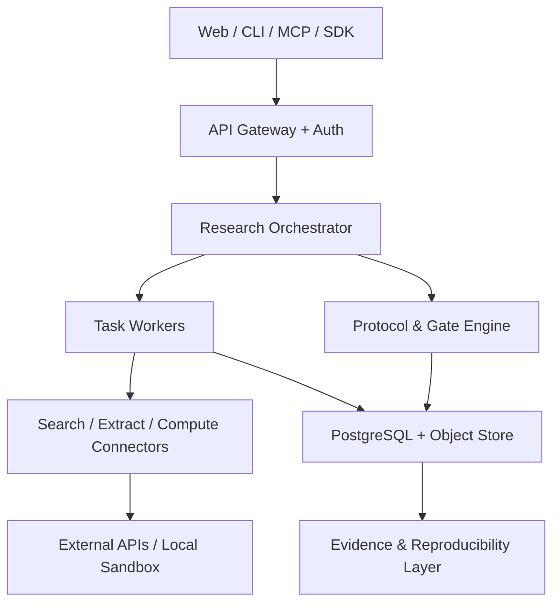

# 技术架构与实现技术

## 1. 总体策略

保留 Riff-Band 的 Python Agent Runtime、固定流水线和 MCP 入口，把它收敛为 `research-orchestrator`。新增 Web/API、持久化、任务队列、研究协议、Revision/Approval、Stage Agent、Python/Stata 执行和证据数据层。MVP 不需要 Kubernetes、Neo4j 和完整 JupyterHub/Stata 云桌面。



## 2. 推荐技术栈

| 层 | MVP 选择 | 后续选择 | 原因 |
|---|---|---|---|
| Web | Next.js + TypeScript + Tailwind/shadcn | React Flow/ECharts | 表单、表格和证据关系可快速迭代 |
| API | FastAPI + Pydantic v2 | GraphQL仅在需求明确后 | 与现有 Python/Pydantic 一致，自动 OpenAPI |
| Orchestrator | Riff-Band async pipeline | Temporal（长周期/高可靠时） | 先复用现有状态机；达到跨日恢复需求再引入 Temporal |
| Queue | Redis + Dramatiq/RQ | Temporal/Celery | MVP 简单；任务需幂等和取消 |
| Database | PostgreSQL 16 | pgvector、Apache AGE可选 | 结构化权威数据 + 搜索/向量；避免过早独立图库 |
| Object store | S3/MinIO | 机构存储适配 | PDF、notebook、图表、日志、manifest |
| Local analytics | DuckDB + Polars | Spark仅在规模证明需要时 | 管科常见中型数据快且可嵌入 |
| Paper parsing | pypdf/PyMuPDF + GROBID | OCR/版面模型 | 结构化引用、章节和页码；扫描件另走 OCR |
| Bibliography | OpenAlex/Crossref/S2/arXiv/Unpaywall | Zotero/机构代理 | 可追溯多源检索与合法全文发现 |
| Causal/stat | statsmodels, linearmodels, DoubleML/EconML | R bridge: fixest/did/grf | 覆盖主要实证与因果设计 |
| Stata | BYOL local/institution batch Runner + do-file | PyStata adapter、更多模板 | 适配管科常见工作流；许可、代码冻结和结果血缘可控 |
| Optimization | Pyomo, OR-Tools, HiGHS | Gurobi/CPLEX按许可 | 开源基线 + 商业求解器插件 |
| ML | scikit-learn, XGBoost/LightGBM, PyTorch | Ray按规模 | 强基线优先，深度模型按需 |
| Repro | uv lock + OCI image + Git SHA + SHA-256 manifest | DVC/lakeFS/MLflow | 先把版本与血缘做正确，再加平台 |
| Observability | OpenTelemetry + structured logs | Prometheus/Grafana | 统一 API、Agent、tool、run trace |
| Auth | OIDC + organization/project RBAC | SAML/SCIM | 机构集成路径清晰 |
| Secrets | cloud secret manager / Vault | HSM按机构要求 | 禁止密钥进入项目文件或 prompt |

## 3. 服务划分

### 3.1 API/Project Service

负责用户、组织、项目、权限、Protocol 版本、审批和审计事件。它是权威写入口，Agent 不直接写数据库。

### 3.2 Research Orchestrator

负责阶段顺序、依赖、任务拆分、状态与恢复；调用 Riff-Band 的 Agent/Tool 运行时。关键设计：

- pipeline 拥有控制流；LLM 不能随意跳阶段；
- step 输入输出使用 Pydantic/JSON Schema；
- task key = project + protocol_version + step + input_hash，保证幂等；
- Agent 只能通过经过权限检查的工具写资产；
- 每一步产生 event、artifact manifest 和 gate report。

### 3.2A Stage Collaboration Service

负责 S0—S9 主智能体注册、当前阶段、handoff readiness 和用户协作状态：

- 每个 stage 声明输入、可编辑/不可变对象、工具白名单、前置 Gate 和人工动作；
- 用户只面对一个 principal agent，内部 helper 不能直接修改批准资产；
- Agent 输出为 revision/patch/issue，不直接更新 current version；
- tool call 前执行 stage + RBAC + gate + data policy 的确定性检查；
- `drafting/awaiting_user/in_review/changes_requested/approved/blocked/completed` 与底层 task status 分离。

### 3.2B Revision & Approval Service

所有人工可修改的研究资产使用不可变 revision：

- `research_asset → asset_revision → approval_request → approval_decision`；
- patch 保存 old/new、理由、证据、作者和 approval impact；
- G0—G5 批准绑定 revision ID 与 SHA-256；Agent actor 永远没有 approve 权限；
- 支持 single-reviewer、four-eyes 和 multi-signoff；
- 依赖图检测上游语义变化并追加 invalidation event；旧决定不删除；
- 原始论文快照、数据、日志、数值 Run Artifact 不可编辑，只能 annotation 或 rerun。

### 3.3 Literature Service

连接 OpenAlex、Crossref、Semantic Scholar、arXiv 和 Unpaywall。实现：

- query protocol 与结果快照；
- 跨源合并而不是 first-success；
- DOI 标准化、题名模糊匹配、版本/预印本关系；
- GROBID/PDF 抽取与 page/section locator；
- 人工筛选和冲突解决；
- BibTeX/CSL JSON/Zotero export。

### 3.3A Topic Intelligence Service

位于 Research Canvas 和 Literature Service 之间，负责把模糊想法变成可审计的已有研究报告：

- Query Planner 生成概念块、同义词/排除词、中英文和相邻学科查询；
- 运行“地平线扫描—系统扩展—空白反向复核”三层检索；
- 用论文卡、引文边和时间信息形成研究流派、共识、争议与未知；
- Gap Engine 将候选空白拆为理论、情境、数据、方法、时间和实践六类；
- 每个空白保存支持/反向证据、覆盖限制和人工批准；
- Report Composer 只从版本化结构对象生成决策摘要、证据附录和候选课题卡；
- Watch Service 对已批准 SearchProtocol 做增量检索，更新不静默覆盖旧报告。

聚类和向量只用于候选组织，不作为事实判断。流派名称、空白和最终候选课题必须可由人修改并留下审计记录。

### 3.4 Knowledge Service

管理 Method、Formula、DataSource、PaperCard、Claim 和 Assumption。PostgreSQL 是真值；向量索引只做候选召回。每个卡片有 schema version、作者、来源和验证状态。

### 3.5 Compute Service

MVP 用一次性 OCI 容器运行已批准模板：

- 只读挂载输入，独立可写输出；
- 默认无网络；按连接器白名单临时开放；
- CPU/内存/时间/文件大小限制；
- 非 root、seccomp、只读基础镜像；
- 输出 manifest、日志、指标、错误和哈希；
- 商业求解器和 Stata 许可证通过独立 adapter，不写入镜像、项目或日志。

敏感数据支持 `local-runner`：云端下发签名协议和代码，数据留在本地，只上传允许的汇总和 manifest。

### 3.5A Stata Runner Service

实现统一 `preflight/submit/cancel/events/collect` 接口，具体程序路径和平台参数只存在于受管 Runner Profile：

- MVP 采用 Stata 官方支持的 batch do-file；P1 增加 PyStata；
- local runner 或 institution runner 使用用户/机构现有许可（BYOL）；
- Runner Profile 保存 Stata 版本、edition、OS、许可模式、并发上限和健康状态，不保存授权码；
- 执行前验证 G2/G3、Analysis Plan revision、do-file hash、Data Contract、变量和许可席位；
- 静态策略默认阻塞 `shell/!`、动态 ado 安装、未批准 Python/Java、网络和路径越界；
- 收集 SMCL/text log、exit code、`about/adopath/which`、`datasignature`、表图/DTA/STER 和 SHA-256 manifest；
- 数值输出进入不可变 Artifact；人工只能修改 interpretation revision。

### 3.6 Gate/Evaluation Service

两类门禁：

1. 确定性：字段完整、DOI、许可、哈希、公式错误、代码测试、统计诊断阈值；
2. 语义辅助：理论一致性、主张强度、替代解释、审稿意见。语义门禁只提供证据与建议，关键批准仍由人作出。

## 4. 最小数据库表

```text
organizations, users, memberships
projects, project_members
research_assets, asset_revisions, revision_patches
approval_requests, approval_decisions, approval_invalidations
stage_sessions, agent_suggestions
protocols, gate_decisions, audit_events
topic_briefs, search_protocols, search_runs, screening_decisions
papers, paper_versions, paper_cards, citation_edges
research_streams, stream_papers, evidence_syntheses
gap_candidates, topic_candidates, related_research_reports, watchlists
data_sources, data_contracts, variables, entity_mappings
methods, formulas, method_formula_links
assumptions, claims, evidence_items, claim_evidence_edges
runs, run_parameters, stata_runner_profiles, stata_runs, artifacts, artifact_lineage
tasks, task_events, model_calls, tool_calls
```

主键使用 UUID/ULID；DOI/ORCID/ROR 是唯一约束之一但不是内部主键。`protocols`、`runs`、`artifacts` 为不可变记录。

## 5. 异步任务协议

任务状态：`queued → running → needs_input | blocked | failed | succeeded | cancelled`。

每个任务包含：

- `task_id/project_id/protocol_version/step_key`；
- `input_artifact_ids` 与 `input_hash`；
- `requested_by` 与权限快照；
- `model/tool/version`；
- `retry_policy/cancellation_token/deadline`；
- 输出 artifact IDs 和 gate report。

任务只允许追加事件；UI 通过 SSE/WebSocket 订阅，不轮询大日志。

## 6. LLM 层

建立 provider-neutral adapter，禁止业务代码直接调用某家 SDK。请求记录：模型、发布日期/版本、system prompt、模板版本、temperature、token、成本、输入/输出 hash、tool calls。

推荐任务分层：

- 小模型：分类、字段抽取、去重候选；
- 强模型：概念澄清、跨论文综合、研究空白候选、研究设计比较、审稿；
- 不用 LLM：DOI 核验、统计、求解、哈希、权限、状态机。

空白判断额外受三条策略约束：LLM 只能创建 `candidate`；必须执行反向查询；只有人工批准后状态才可变为 `supported_gap`。

所有抽取使用严格 schema；解析失败进入修复一次，仍失败则人工队列，不无限自愈。

## 7. API 轮廓

```text
POST   /v1/projects
POST   /v1/projects/{id}/protocols
POST   /v1/protocols/{id}/approve
POST   /v1/projects/{id}/assets/{assetKey}/revisions
GET    /v1/assets/{id}/revisions/{revisionId}/diff
POST   /v1/projects/{id}/approval-requests
POST   /v1/approval-requests/{id}/decisions
GET    /v1/projects/{id}/approval-inbox
GET    /v1/projects/{id}/stage-sessions/current
POST   /v1/stage-sessions/{id}/suggestions/{suggestionId}/decisions
POST   /v1/projects/{id}/topic-briefs
POST   /v1/projects/{id}/topic-scout-runs
GET    /v1/topic-scout-runs/{id}
GET    /v1/projects/{id}/related-research-reports/latest
POST   /v1/related-research-reports/{id}/approve
POST   /v1/projects/{id}/watchlists
POST   /v1/projects/{id}/search-runs
GET    /v1/search-runs/{id}/results
POST   /v1/papers/{id}/extract
POST   /v1/projects/{id}/design-recommendations
POST   /v1/projects/{id}/data-contracts
POST   /v1/projects/{id}/runs
POST   /v1/projects/{id}/stata-runs/preflight
POST   /v1/projects/{id}/stata-runs
GET    /v1/stata-runs/{id}
POST   /v1/runs/{id}/cancel
GET    /v1/runs/{id}/events
POST   /v1/projects/{id}/claims
POST   /v1/claims/{id}/evidence
POST   /v1/projects/{id}/exports
```

## 8. 什么时候再引入更重技术

- Temporal：出现跨日任务、跨服务补偿和可靠恢复的真实需求；
- Kubernetes：持续并发沙箱超过单机/托管容器能力；
- Neo4j：Claim/Evidence 查询超出 PostgreSQL 递归 CTE 与边表能力；
- Spark：单项目数据超过 DuckDB/Polars 的单机上限；
- JupyterHub：用户需要长驻交互环境，而不仅是可复现批运行。

## 9. 关键 ADR 决策

1. `Protocol` 和 `Run` 不可变；修订产生新版本。
2. PostgreSQL 是真值，向量库不是事实数据库。
3. LLM 不直接执行任意代码；代码先生成、静态/策略检查，再进入沙箱。
4. 敏感数据默认本地执行；云端只持有许可允许的内容。
5. MVP 使用表格化 Evidence Graph，验证价值后再投入复杂图形交互。
6. AI 的修改以 patch/revision 表达；批准只绑定 hash，不绑定“最新版本”指针。
7. G0—G5 由独立 Approval Service 执行；Agent Runtime 没有 approve capability。
8. Stata 使用 BYOL local/institution Runner；MVP batch first，PyStata 后置。
9. 原始运行输出不可编辑；任何数值变化必须来自新 Run。
