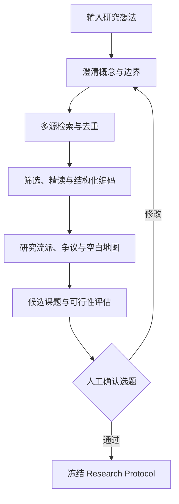

# 课题侦察与已有研究报告：产品规格

版本：0.2  
日期：2026-07-16

## 1. 要解决的问题

科研选题不能从一句“我想研究……”直接跳到模型和论文写作。研究者在正式开题前，至少要回答五个问题：

1. 已经有哪些人研究过，形成了哪些主要流派？
2. 现有研究在哪些结论上较一致，哪些地方仍有争议？
3. 所谓“研究空白”是真的无人研究，还是换了术语、换了学科或换了数据？
4. 这个课题有哪些可获得的数据和可执行的方法？
5. 如果继续做，最有价值且可证伪的研究问题是什么？

AI4MS 新增 **Topic Scout（课题侦察）**。用户输入一个模糊想法后，系统先搜索、筛选并结构化已有研究，再提交一份可核查的“相关研究与选题建议报告”。报告通过人工确认后，才进入 Research Protocol 和正式研究设计。

## 2. 产品承诺与边界

产品承诺：

- 把一个模糊研究想法转成可检索、可比较的概念边界；
- 尽可能覆盖经典研究、近年进展、相邻学科和反向证据；
- 每个事实、论文和结论都可回到来源；
- 明确区分“没有检索到证据”“证据不足”“已有证据冲突”和“较稳定共识”；
- 把研究空白拆成理论、情境、数据、方法、时间和实践六类；
- 给出 2—3 个候选问题及其可行性、风险和下一步。

产品不承诺：

- 自动证明选题“绝对原创”；数据库覆盖和术语变化使这种承诺不成立；
- 用引用量代替论文质量；
- 绕过数据库订阅、版权或机构权限获取全文；
- 在没有证据的情况下生成确定性结论；
- 代替导师、领域专家或方法审核者作最终选题决定。

## 3. 从玻尔（Bohrium）借鉴什么

根据玻尔公开产品资料，本方案借鉴以下已被验证的产品方向：

- **从自然语言问题开始**：用户不必先写复杂检索式；
- **先厘清问题，再追溯证据，再沉淀产出**：检索不止返回链接，还能延续为调研、综述和报告；
- **回答与文献来源绑定**：让用户可以核查论文和引用依据；
- **发现、精读、知识库和订阅连成工作流**：一次搜索可以沉淀为个人或团队研究资产；
- **持续追踪领域进展**：把一次性选题报告升级为可更新的研究雷达。

AI4MS 在此基础上增加管科科研所需的结构：检索协议、纳排记录、理论—数据—方法编码、证据冲突、识别假设、数据可得性、研究空白类型、人工 Gate 和可复现研究包。

注意：上述对标基于 2026-07-16 可访问的公开页面，不代表对玻尔内部技术或未公开能力的判断。

## 4. 用户看到的产品形态

### 4.1 入口：一句话提出想法

示例：

> 我想研究生成式 AI 的使用是否提升企业创新绩效。

系统只追问最必要的信息：研究对象、地域、时间、想解释还是预测、是否关心因果、已有数据或种子论文。用户可以暂时回答“不确定”。

### 4.2 研究问题澄清卡

系统把想法拆成：

- 核心概念及同义词；
- 研究对象与分析单位；
- 结果变量与可能机制；
- 时间、地域和行业边界；
- 相邻主题与容易混淆的概念；
- 中文、英文和学科术语的检索词簇。

用户批准后生成 `topic_brief_v1`，后续检索均引用这一版本。

### 4.3 课题雷达

界面同时展示五个视角：

- **经典基础**：高影响且构成理论或方法基础的研究；
- **最新进展**：近年研究、工作论文与新数据/新方法；
- **研究流派**：按理论、机制、方法或应用情境聚类；
- **争议与反证**：结论不一致、边界条件和失败结果；
- **相邻机会**：其他学科使用不同术语研究的相关问题。

每个视角都显示文献数量、代表论文、证据等级、来源数据库和检索快照日期。

### 4.4 研究空白地图

系统不只输出一句“现有研究较少”，而是按六类呈现：

| 空白类型 | 要回答的问题 | 常见误判 |
|---|---|---|
| 理论空白 | 现有理论无法解释哪个机制或边界？ | 仅仅没有使用某个新名词 |
| 情境空白 | 国家、行业、平台或人群是否改变机制？ | 只换样本但没有理论意义 |
| 数据空白 | 新数据能否观察过去不可见的行为或过程？ | 数据更大但测量更差 |
| 方法空白 | 新设计能否解决识别、求解或预测缺陷？ | 只换更复杂模型 |
| 时间空白 | 制度、技术或冲击是否使旧结论失效？ | 仅把样本期向后延长 |
| 实践空白 | 决策者缺少哪种可执行证据？ | 有管理口号但无可检验问题 |

空白只能标记为 `candidate`。只有在检索覆盖、反向查询、相邻术语和专家复核通过后，才可标记为 `supported_gap`。

### 4.5 候选课题卡

系统给出 2—3 张候选卡，而不是替用户下唯一结论。每张卡包含：

- 一句话研究问题；
- 已知与未知；
- 预期理论/实践贡献；
- 最小可行数据；
- 首选与备选方法；
- 关键假设与失败条件；
- 新颖性、重要性、可行性、可证伪性四维评分及依据；
- 最危险的相近论文；
- 建议：继续、缩小、改写、合并或暂停。

### 4.6 可导出的已有研究报告

报告默认提供“决策摘要”和“证据附录”两层。非技术读者先看摘要，研究者可继续查看检索式、论文卡和来源定位。

## 5. 报告固定结构

1. **课题一句话说明**：研究什么、为什么重要；
2. **检索范围与快照**：数据库、日期、语言、年份、检索词和限制；
3. **研究版图**：主要流派、时间演化和代表论文；
4. **核心结论**：稳定共识、争议、反证与未知；
5. **代表研究表**：问题、理论、数据、方法、结论、局限与来源定位；
6. **研究空白地图**：六类空白及支持证据；
7. **数据与方法可行性**：可用数据、许可、样本单位、方法及关键假设；
8. **候选研究问题**：2—3 个方案及四维评估；
9. **风险与停止条件**：重复性、不可识别、数据不可得、伦理或许可风险；
10. **建议的下一步**：需要精读的论文、需要验证的数据、需要请教的专家；
11. **参考文献**：DOI/URL、来源库、文献版本；
12. **审计附录**：检索式、命中/去重/纳排数、排除理由、模型与人工修改记录。

## 6. 端到端工作流

### Step 1：问题澄清

Question Coach 生成概念树、同义词、排除词和初步研究边界。关键概念必须由用户确认，避免 AI 在一开始就把问题带偏。

### Step 2：三层检索

- **地平线扫描**：快速找到综述、经典文献、近年高相关论文和种子学者；
- **系统扩展**：多数据库布尔检索、引文前向/后向扩展、相邻术语与中英文扩展；
- **空白复核**：专门搜索可能推翻“空白”的论文、预印本、其他学科和不同表述。

### Step 3：去重与筛选

DOI 为第一键；无 DOI 时使用题名、作者、年份和版本关系。系统记录每一条纳入/排除决定及理由，保留预印本—正式发表关系。

### Step 4：结构化编码

为每篇核心论文抽取：问题、理论、数据、样本、变量、方法、公式、发现、稳健性、局限、未来研究与证据定位。摘要级信息不能伪装成全文结论。

### Step 5：综合而非堆砌

系统按“研究问题—理论—数据—方法—结论”聚类，识别一致、冲突、条件性结论和证据不足。引用量只用于发现候选，不直接决定结论权重。

### Step 6：空白与可行性复核

Gap Analyst 为每个候选空白生成支持证据、反向证据、覆盖限制和置信等级。Data Steward 与 Design Advisor 同时检查数据许可、变量可观测性、样本规模和方法假设。

### Step 7：报告和人工 Gate

报告先产生草案；用户可以对论文、流派、空白和候选课题逐条接受、修改或驳回。只有人工批准的候选课题才能生成 Research Protocol v1。

## 7. 证据状态与防幻觉规则

每条综合结论必须处于以下状态之一：

- `supported`：有多项可定位研究支持；
- `contested`：存在方向、情境或方法上的冲突；
- `limited`：证据数量、质量或覆盖有限；
- `not_found`：在给定检索协议内未检索到；
- `inference`：平台基于多项证据作出的推断，必须明确标注；
- `human_verified`：经用户或专家确认。

确定性规则：

- 报告中的每篇论文必须有内部 paper ID 和外部标识；
- 每个关键数字必须来自检索快照或结构化论文卡；
- 没有定位信息的全文事实不得进入高置信摘要；
- “首个”“无人研究”“完全空白”等绝对表述默认禁止；
- 搜索失败、付费墙、语言限制和数据库缺失必须进入报告限制；
- 低置信抽取、相互冲突证据和疑似版本重复进入人工队列。

## 8. 数据对象

新增核心对象：

- `TopicBrief`：用户想法、边界、概念、同义词、排除词和批准状态；
- `SearchProtocol`：数据库、查询、日期、过滤器、快照与命中数；
- `PaperCard`：论文结构化信息和字段级证据定位；
- `ResearchStream`：一组有共同理论/问题/方法的论文及命名依据；
- `EvidenceSynthesis`：共识、争议、未知及其证据边；
- `GapCandidate`：空白类型、支持/反向证据、覆盖限制和置信；
- `TopicCandidate`：问题、贡献、数据、方法、假设、风险和评分依据；
- `RelatedResearchReport`：版本化报告、来源快照和人工批准记录；
- `Watchlist`：关键词、期刊、学者和更新频率。

JSON Schema 见 `02_knowledge_bases/schemas/related_research_report.schema.json`。

## 9. 技术实现

### 9.1 服务组件

1. **Query Planner**：从 TopicBrief 生成概念块、布尔查询和多语言变体；
2. **Retrieval Broker**：并行调用 OpenAlex、Crossref、Semantic Scholar、arXiv；机构许可具备后再接 Web of Science、Scopus、CNKI 等；
3. **Entity Resolver**：DOI 规范化、题名匹配、作者/年份校验、版本关系；
4. **Screening Service**：规则 + 模型相关性排序 + 人工纳排；
5. **Paper Reader**：PDF/摘要解析、字段抽取、页码/章节/句子定位；
6. **Landscape Engine**：嵌入候选召回、引文网络、时间/主题聚类；聚类命名和合并须可人工编辑；
7. **Evidence & Gap Engine**：按结构化字段形成共识/冲突/空白候选；
8. **Report Composer**：只从已保存的论文卡、综合对象和审计数据组稿；
9. **Watch Service**：按批准检索式定期增量检索并生成变更摘要。

### 9.2 LLM 与确定性工具分工

适合 LLM：概念澄清、术语扩展、字段抽取、研究流派命名、跨论文综合、候选问题改写。

不交给 LLM：DOI 校验、去重键、命中计数、引用网络边、日期/版本、权限、许可、状态机、报告中的统计数字。

### 9.3 管科专用逻辑

- 识别分析单位：个人、团队、企业、平台、供应链、地区、国家；
- 区分解释、因果、预测、规范/优化和理论构建目标；
- 编码理论构念、机制、边界条件与可证伪命题；
- 连接方法库、公式库和数据源库；
- 对因果识别、选择偏差、内生性、时间泄漏、可行性和外部效度给出专属警示；
- 区分“论文更多”和“证据更强”。

## 10. MVP 与后续版本

### MVP（W3—W6）

- 一句话想法 + 澄清表单；
- OpenAlex/Crossref/S2/arXiv 多源并集与去重；
- 30—100 篇候选文献及人工筛选；
- 摘要级 PaperCard，明确 evidence level；
- 3—8 个研究流派、共识/争议/未知；
- 2—3 张候选课题卡；
- Markdown/DOCX 相关研究报告；
- 检索快照、参考文献与审计附录。

### P1（W7—W12）

- 全文解析与定位；
- 引文前向/后向扩展；
- 交互式研究空白地图；
- 数据与方法可行性自动联动；
- Watchlist 增量更新；
- Zotero/BibTeX/CSL 导入导出。

### P2（W13—W20）

- 机构数据库连接器和中文学术来源；
- 双人筛选、冲突仲裁和团队评论；
- 专家验证工作台；
- 研究流派演化、学者/机构地图；
- 由报告一键生成并冻结 Research Protocol。

## 11. 验收标准

- A21 检索覆盖：30 个基准课题中，专家指定的种子论文 Recall@50 ≥ 0.90；
- A22 去重：DOI/题名变体/预印本—终版准确率 ≥ 98%；
- A23 来源真实性：报告中论文外部标识准确率 ≥ 99%，虚构文献为 0；
- A24 可追溯：报告中 100% 核心结论能回到 paper/evidence ID；
- A25 状态诚实：未检索到与证明不存在严格区分，绝对原创表述为 0；
- A26 空白复核：每个 `supported_gap` 至少有一组反向查询和一名人工批准者；
- A27 可用性：非技术用户可在 10 分钟内读懂研究版图、争议、候选课题和下一步；
- A28 可复现：同一 SearchProtocol 可重放，并保留数据库、查询、日期和原始计数；
- A29 许可：受限全文不得被未授权上传或发送到外部模型；
- A30 转化：批准的候选课题可无信息丢失生成 Research Protocol v1。

## 12. 第一批开发任务

1. 增加 TopicBrief、GapCandidate、TopicCandidate 和 RelatedResearchReport schema；
2. 把 Riff-Band 文献搜索改为真正的多源并集；
3. 保存 SearchProtocol、后端计数、错误、快照与去重关系；
4. 为 PaperCard 增加理论、数据、方法、结论、局限和字段级来源；
5. 先用规则 + LLM 生成研究流派，再提供人工合并/改名；
6. 实现报告模板和引用/数字审计；
7. 在 G1 前增加“已有研究报告已审阅”条件；
8. 用 10 个真实管科想法建立评测集，记录专家漏检和错误空白判断。

## 13. 主要参考

- 玻尔产品介绍：https://www.bohrium.com/intro
- 华东师范大学图书馆“试用玻尔 AI 科研平台”：https://lib.ecnu.edu.cn/af/0b/c38310a700171/page.htm
- 玻尔科学计算平台：https://www.dp.tech/product/bohrium/workspace
- PRISMA 2020：https://www.prisma-statement.org/prisma-2020
- PRISMA-S（检索报告扩展）：https://www.prisma-statement.org/prisma-search
- PRISMA-ScR（范围综述）：https://www.prisma-statement.org/scoping
- Campbell Evidence and Gap Maps：https://www.campbellcollaboration.org/2025/04/the-relevance-of-evidence-gap-maps-for-evaluation-and-decision-making/

