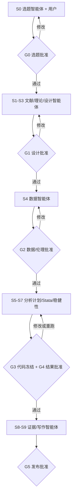

# 用户工作流与人机审批点

## 1. 端到端主流程

所有智能体先生成可编辑草案或 patch。用户可以接受、修改、拒绝、回滚和分叉；只有人工审批后，当前阶段的冻结版本才能成为下一阶段的权威输入。

## 2. 新课题：先看别人做了什么，再决定做什么

1. 用户用一句话输入想研究的现象或问题；系统只追问研究对象、目标、时间、地域和已有线索等必要信息。
2. Question Coach 把自然语言想法整理成概念边界、同义词、排除词和中英文检索词，用户确认 TopicBrief。
3. Topic Scout 先做快速扫描，再进行多数据库扩展检索和“空白反向复核”，避免因为术语不同而误判无人研究。
4. 系统去重并筛选文献，将核心论文整理成问题、理论、数据、方法、结论和局限卡片。
5. Evidence Synthesizer 返回经典基础、近年进展、研究流派、稳定共识、冲突证据和仍未知事项。
6. Gap Analyst 按理论、情境、数据、方法、时间和实践六类形成候选空白，并展示支持证据、反向证据和覆盖限制。
7. 系统生成“已有研究与选题建议报告”和 2—3 张候选课题卡；用户可以接受、改写、合并或暂停。
8. 选题通过 G0 后，Theory Agent 与 Design Agent 才比较理论机制、研究设计、关键假设、数据要求和不能解决的问题。
9. 用户可直接修改问题、假设和主备设计；G1 批准后系统冻结 Research Protocol，并生成下一阶段待办。

阻塞条件：问题只是主题名且用户拒绝澄清；关键概念未确认；检索范围不足以支持空白判断；候选课题与已有研究高度重复却没有新增贡献；核心数据不可得；方法关键假设明显不成立。

### 用户拿到的已有研究报告

- 一页决策摘要：研究版图、共识/争议、候选空白和建议；
- 研究流派与时间脉络；
- 代表论文及其问题、数据、方法、结论和局限；
- 数据与方法可行性；
- 2—3 个候选研究问题及风险；
- 检索数据库、检索式、日期、纳排数量和参考文献；
- 明确标出“证据支持”“存在争议”“证据有限”“本次未检索到”和“平台推断”。

## 3. 系统综述：从检索协议到证据综合

1. 定义数据库、检索式、年份、语言、文献类型和纳排标准。
2. 并行检索后合并去重；记录每个后端的原始命中数。
3. 标题摘要筛选；双人冲突进入仲裁。
4. 全文/摘要卡抽取，字段带页码/句子和证据等级。
5. 生成 PRISMA 计数、编码一致性与缺失字段列表。
6. 聚类研究问题、理论、方法、数据和发现；反向检查每个综合 claim 的证据。
7. 形成综述、研究空白与方法/数据地图。

## 4. 因果/实证课题

1. 先定义 ATE/ATT/LATE 或具体机制，不先选回归式。
2. 绘制 DAG，登记处理、结果、混杂、机制和碰撞点。
3. Data Steward 检查单位、样本期、处理时间、许可与连接键。
4. Design Advisor 比较 DiD、IV、RDD、SC、实验等条件。
5. 冻结基准式、标准误层级、主要/次要结果和稳健性计划。
6. 执行器运行基准、预趋势/平衡/弱工具等设计专属诊断。
7. Reviewer Agent 对失败项生成影响评估，更新 claim 状态。
8. 人工批准后进入机制、异质性与写作。

### 使用 Stata 的执行分支

1. Analysis Plan Agent 把批准的 estimand、样本、变量、固定效应、标准误、权重、主次结果和稳健性整理成可编辑计划。
2. 用户选择 Stata，Stata Analyst Agent 生成 do-file patch，并把每段代码连接到 MethodCard、FormulaCard 和计划字段。
3. 用户逐段接受、修改或拒绝；平台检查变量、唯一键、`xtset/tsset`、命令可用性、危险命令、许可席位和资源。
4. 方法审核者批准 G3；批准绑定计划 revision、do-file hash、Data Contract 和 Runner 环境。
5. Local/Institution Runner 使用自带许可执行 batch do-file，保留 SMCL/text log、数据签名、版本/ado 清单、退出码和表图。
6. Robustness Agent 汇总设计专属诊断；用户可以补跑、分叉或回到分析计划，不能直接手改原始数值。
7. Evidence Agent 把 Stata Run 产物连接到 Claim；用户在 G4 决定支持、限定、混合、反驳或撤回。

## 5. 优化/解析课题

1. 把自然语言业务规则转为集合、参数、变量、目标和约束草案。
2. 用户核对单位、时序、参与者和信息结构。
3. 先生成可手算的小实例和单元测试，再接真实规模。
4. 运行基准模型，检查可行性、约束绑定、最优 gap 和运行时间。
5. 加入不确定性、分解或启发式；必须与强基线比较。
6. 做参数现实性、压力和样本外场景；把不可执行约束反馈给模型。
7. 输出数学模型、代码、测试实例、性能表和管理解释。

## 6. 预测/机器学习课题

1. 定义预测时点、标签可用时点和决策用途。
2. 系统检测时间/实体泄漏风险并生成切分方案。
3. 先跑朴素、线性和树模型基线，再运行深度/生成模型。
4. 固定测试集；所有调参只在训练/验证集。
5. 评估误差、校准、组别/时间外推、漂移、公平和决策价值。
6. 对 NLP/LLM 记录语料许可、模型、提示、版本和人工审计样本。
7. 输出 model card、run manifest 与部署边界。

## 7. 六个不可自动越过的 Gate

| Gate | 批准人 | 必须看到的内容 | 失败后的动作 |
|---|---|---|---|
| G0 已有研究与候选课题 | 研究者/导师 | 检索范围、流派、争议、空白证据、最近似研究、数据/方法可行性 | 补检索、缩小/改写课题或暂停 |
| G1 研究问题、理论与设计 | 研究者/导师；方法审核者会签 | 问题、贡献、理论机制、备选设计、关键假设 | 改问题、理论或设计 |
| G2 数据、伦理与许可 | 数据负责人/研究者；必要时伦理角色 | 来源、许可、PII、变量、样本、快照、执行位置 | 本地执行、换数据或停止 |
| G3 分析计划与代码冻结 | 方法审核者 | estimand/目标、基准、样本、标准误、诊断、稳健性、do-file/notebook hash | 补设计、改代码或标注探索性 |
| G4 结果与核心主张 | PI/作者 + 方法审核者 | 支持/反证、失败检验、边界、Stata/Python Run 与复现结果 | 降低置信、重跑或撤回 claim |
| G5 成稿与发布 | PI/通讯作者/交付负责人 | 引用、数值一致、披露、复现包、数据许可 | 修改成稿、补审计或停止发布 |

团队项目默认 four-eyes；个人项目可以由同一人显式批准，但会标记为 `single_reviewer`，不能冒充独立复核。任何上游语义变更都会按依赖矩阵失效下游批准。

## 8. 失败与恢复体验

- 每个长任务有 `queued/running/needs_input/blocked/failed/succeeded/cancelled` 状态。
- 失败保留输入、日志和已完成资产；重试必须幂等。
- “需要用户输入”与“系统错误”分开，避免无限重试。
- 用户可以从任一冻结协议版本分叉实验，不覆盖主线。
- 任何 Agent 都只能建议越过门禁；真正的批准由确定性权限检查完成。
- Agent 的修改只作为 patch；用户直接修改同样生成 revision、diff 和变更原因。
- 原始论文快照、数据、运行日志和数值结果不可编辑，只能纠正元数据、添加注释或重新运行。
