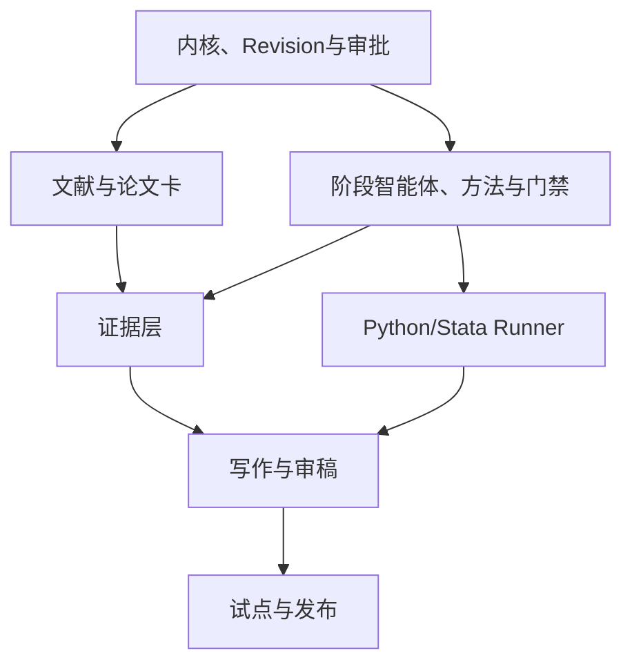

# AI4MS 24 周开发 Roadmap

## 总体目标

24 周后交付一个可供 3—6 个真实课题试用的平台：能从一句研究想法生成可追溯的已有研究与选题建议报告，由 S0—S9 阶段智能体与用户协作完成 Research Protocol、多源文献、理论/设计、数据、Python/Stata 分析、稳健性、Claim–Evidence、写作和复现包；G0—G5 关键版本均可人工修改并必须人工批准；Web、CLI、MCP 共用同一后端。

## Phase 0：内核清理与可测基线（W1—W2）

交付：

- dev 依赖、锁文件、CI、lint/测试基线；
- Management Science DomainProfile；
- 去除 RIS/ISAC 等课题硬编码；
- ResearchProtocol v0.1 与 legacy adapter；
- ResearchAsset/Revision、ApprovalRequest/Decision 最小模型，Agent 无 approve 权限；
- 3 个 benchmark fixtures：因果、优化、平台供应链。

退出指标：现有测试通过；三个 fixtures 不出现领域串扰；旧 `/research` 与 MCP 调用兼容。

## Phase 1：检索与研究协议 MVP（W3—W6）

交付：

- FastAPI Project/Protocol/Search API；
- TopicBrief、Topic Scout Run、Gap/Topic Candidate 和 RelatedResearchReport API/Schema；
- PostgreSQL 项目、协议、搜索、论文、筛选、研究流派、综合结论、候选空白与报告表；
- OpenAlex/Crossref/S2/arXiv 多源并行、快照、合并、去重；
- PaperCard v2：字段来源等级、locator、置信与人工队列；
- 三层检索：地平线扫描、系统扩展、空白反向复核；
- 研究流派、共识/争议/未知、六类候选空白和 2—3 张候选课题卡；
- 最小 Web：项目、Topic Scout、相关研究报告、Research Canvas、Literature Lab 表格；
- PRISMA 计数与 RelatedResearchReport Markdown/DOCX/JSON、BibTeX/CSV 导出。

退出指标：10 个基准课题的专家种子论文 Recall@50 ≥0.90；100 条去重准确率 ≥98%；DOI 准确率 ≥99%；核心报告结论 100% 可追溯；未批准空白不能宣称成立；搜索任务可取消/重试；G0/G1 绑定 revision/hash，人工修改和 changes requested 生效。

## Phase 2：方法知识与证据层（W7—W10）

交付：

- 28 张方法卡、47 张公式卡、40 个数据源卡导入 registry；
- Design Advisor：目标/数据/假设驱动的推荐与阻塞；
- Assumption Registry；
- Claim/Evidence/Assumption 表与双向链接；
- 五泳道 Gate registry；
- 方法比较、Data Contract、Evidence 表格 Web 页面；
- Stage Agent Registry（S0—S9）与 Stage Workspace 最小页面；
- G0—G3 Approval Inbox、diff、评论、四眼策略和上游变更失效引擎。

退出指标：30 个设计 benchmark 的关键假设召回 ≥90%；核心 claim 证据覆盖规则可强制；G2/G3 可阻塞任务；Agent 自批、过期 revision 批准和错误失效为 0。

## Phase 3：计算与数据执行（W11—W14）

交付：

- OCI Python sandbox；网络/资源/权限策略；
- 运行队列、事件流、取消/重试、artifact manifest；
- DuckDB/Polars 数据层；
- 5—8 个开放连接器：OpenAlex、World Bank、FRED、SEC、NYC TLC、OSM 等；
- OLS/FE/DiD、ML baseline、LP/MILP 三类可执行模板；
- BYOL Stata local/institution batch Runner、do-file Studio、预检与许可席位队列；
- Stata 数据审计、OLS、FE、DiD 模板，SMCL/text log、`datasignature`、版本/ado 与输出 manifest；
- local-runner POC（敏感数据不出本地）。

退出指标：固定输入/种子复现率 ≥95%；Stata 基准重放达到规定容差；沙箱逃逸/危险 Stata 命令/非白名单网络测试全部失败；G3 和 license/seat gate 有效。

## Phase 4：稳健性、写作与审稿（W15—W18）

交付：

- 因果、优化、ML 三泳道自动诊断与稳健性矩阵；
- Repro Auditor 与 Skeptical Reviewer；
- 从批准 claims 生成大纲/段落；
- DOI、引文蕴含、数值—表图一致性审计；
- Markdown/LaTeX/DOCX/BibTeX 与研究包导出；
- 审批历史和审稿答复；
- G4 结果/Claim 与 G5 成稿/发布审批；解释可改、原始数值不可改；
- Stata 与 Python 结果进入统一 Claim–Evidence 与数值一致性审计。

退出指标：故意注入的 20 类设计/代码错误至少 90% 被门禁发现；成稿核心结论 100% 可回溯。

## Phase 5：协作、治理与真实试点（W19—W22）

交付：

- OIDC、组织/项目 RBAC、审计与配额；
- 团队筛选冲突、评论、任务与通知；
- 模型调用/成本/延迟 observability；
- 6 个真实课题试点；
- 人工修改原因与错误分类仪表盘；
- 数据保留/删除与项目导出。

退出指标：无越权访问；删除演练通过；试点均完成 G0—G5 至少一次；至少 3 个课题使用 Stata；每阶段保留人工修改/审批；复现包由非作者成功运行。

## Phase 6：发布准备（W23—W24）

交付：

- 安全与隐私 review、威胁模型；
- 性能/并发/故障恢复演练；
- 运营手册、用户指南、方法免责声明；
- v0.1 发布、演示项目与回滚计划；
- 基于试点数据的 v0.2 优先级。

Go/No-Go：P0 缺陷为 0；引文错误率 <1%；复现率 ≥95%；核心门禁不可绕过；至少 4/6 试点愿意继续使用。

## 依赖关系

## 团队最小配置

- 1 产品/科研负责人（兼用户研究与方法决策）；
- 2 后端/Agent 工程师；
- 1 前端工程师（W3 起）；
- 1 数据/科研工程师（W7 起）；
- 0.5 DevSecOps（W10 起）；
- 每条试点泳道一名兼职方法顾问。

若只有 2—3 人，将 Roadmap 延长到 36 周，优先保留 Protocol、Revision/Approval、Literature、Method/Gate、Evidence 和 Stata batch Runner，延后 Web 花哨可视化、PyStata 与更多语言计算。
